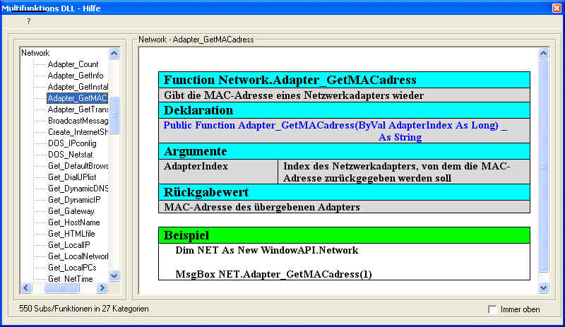



## Mutifunktions DLL

### Description

This DLL includes *over 500* Functions and Subs

All Functions and Subs are documentadet by an own Help System

This DLL does not need any other components

You only need the DLL

I worked over 1 year at this nice proggie .)

so....enjoy it

(Sorry.....the help system is only in german)
 
### More Info
 

             |
---                |---
**Submitted On**   |2004-11-21 15:55:44
**By**             |[Wolfgang Ehrhardt](https://github.com/Planet-Source-Code/PSCIndex/blob/master/ByAuthor/wolfgang-ehrhardt.md)
**Level**          |Intermediate
**User Rating**    |5.0 (25 globes from 5 users)
**Compatibility**  |VB 6\.0
**Category**       |[Miscellaneous](https://github.com/Planet-Source-Code/PSCIndex/blob/master/ByCategory/miscellaneous__1-1.md)
**World**          |[Visual Basic](https://github.com/Planet-Source-Code/PSCIndex/blob/master/ByWorld/visual-basic.md)
**Archive File**   |[Mutifunkti18210411222004\.zip](https://github.com/Planet-Source-Code/wolfgang-ehrhardt-mutifunktions-dll__1-57379/archive/master.zip)

